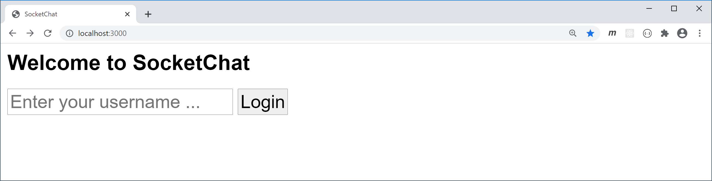
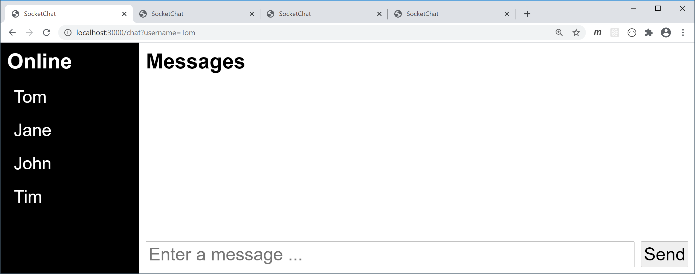
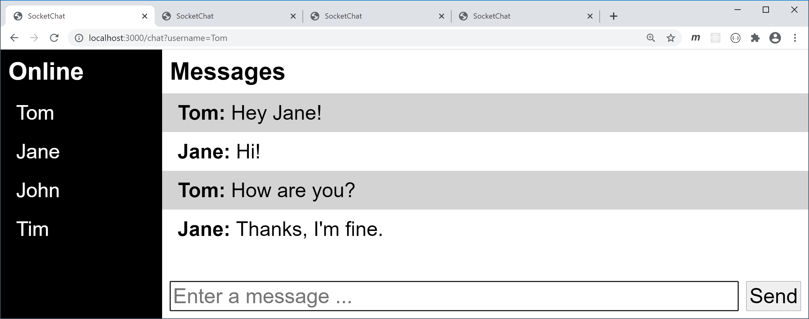

# Socket Chat

Erweitern Sie die vorhandene Applikation um die folgenden Funktionen.

## Task 1: Chat Message Broadcast

Passen Sie die Applikation folgendermaßen an:

- Der Server schickt eine neue Nachricht nicht an den Ersteller zurück, sondern versendet sie nur an alle anderen Clients.

- Beim Ersteller wird die Nachricht stattdessen im `submit event handler`  zur HTML-Liste `message-list` hinzugefügt. Danach wird zu der neuen Nachricht gescrollt (Tipp: `listItem.scrollIntoView()`) .

  

## Task 2: Login Page

Erstellen Sie eine Startseite für die Eingabe des Benutzernamens. Dieser wird an den Pfad `/chat` weitergeleitet. Verzichten Sie dabei auf die Verwendung von JavaScript.

Erweitern Sie anschließend die `chat.js`, sodass der Benutzername aus der URL eingelesen und auf der Konsole ausgegeben wird (Tipp: `new URLSearchParams(window.location.search)`).

## Task 3: Login Server

Passen Sie die `app.js` und die `chat.js` folgendermaßen an:

- Nach erfolgreichem Aufbau der Socket-Verbindung sendet der Client das Event `login` inklusive des Benutzernamens an den Server.
- Der Server fügt den empfangenen Benutzer zum Socket Objekt hinzu (`socket.username`).
- Der Server fügt den empfangenen Benutzer zum Array `usernames` hinzu.
- Der Server antwortet dem Client mit dem Event `logged in` und sendet dabei alle Benutzernamen.
- Der Client gibt die empfangenen Benutzer auf der Konsole aus.

**Hinweis:** Sobald die Socket-Verbindung erfolgreich aufgebaut wurde, versendet der Server das Event  `connect` an den Client.

## Task 4: Online Users

Passen Sie die `chat.js` so an, dass die Benutzer in der HTML-Liste `user-list` angezeigt werden.

## Task 5: User Joined Broadcast

Passen Sie die `app.js` und die `chat.js` folgendermaßen an:

- Der Server informiert alle anderen Clients mit dem Event `user joined` über den Login des Benutzers. Dessen Name wird beim Event mitgesendet.

- Die Clients zeigen den empfangenen Benutzernamen in der HTML-Liste an.

  

## Task 6: User Left Broadcast

Passen Sie die `app.js` und die `chat.js` folgendermaßen an:

- Wenn ein Client die Socket-Verbindung trennt, wird der Benutzername aus dem Array `usernames` entfernt.
- Außerdem sendet der Server das Event `user left` inklusive des Benutzers an alle anderen Clients.
- Die Clients entfernen den empfangenen Namen aus der HTML-Liste.

**Hinweis:** Die Verbindung zum Server wird beispielsweise beim Aufruf einer anderen Seite oder beim Schließen des Browser-Tabs getrennt.

## Task 7: Chat Message Sender

Passen Sie die `app.js` und die `chat.js` folgendermaßen an:

- Der Server versendet mit dem Event `chat message` ein Objekt bestehend aus der Nachricht und dem Benutzernamen des Erstellers (Tipp: `socket.username`).
- Die Clients zeigen den jeweiligen Absender vor der Nachricht an.

